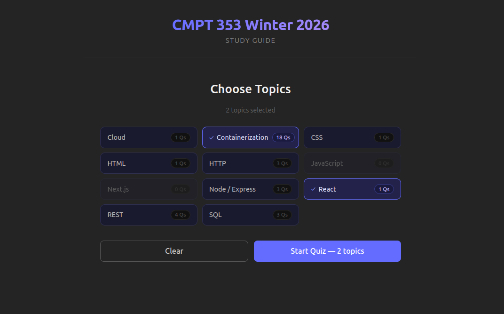
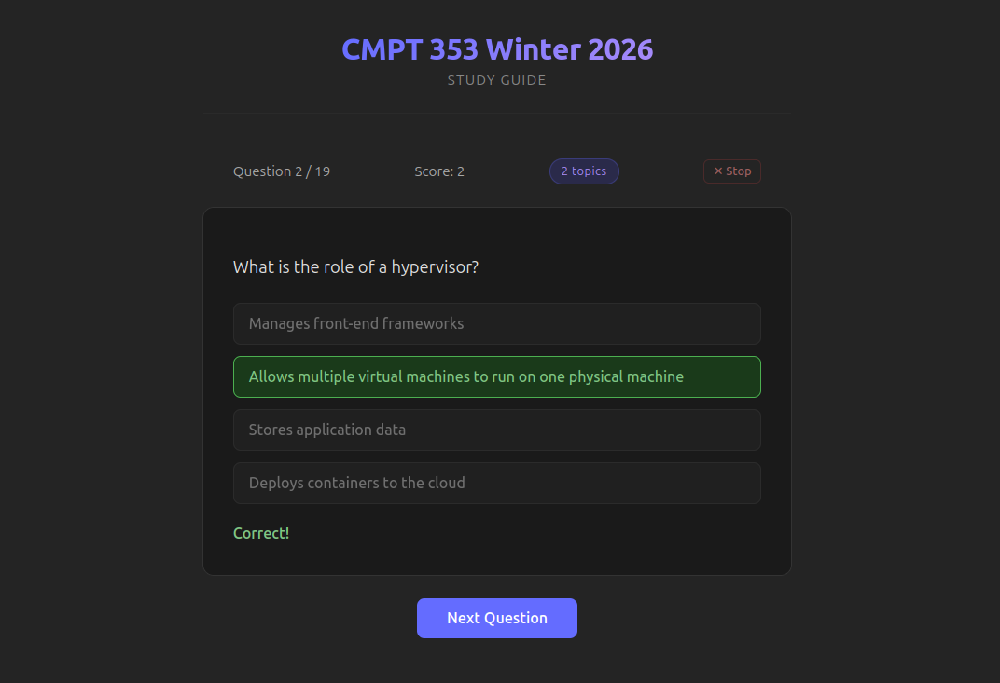

# 353 Study Guide

An interactive multiple choice quiz app to help study for CMPT 353 Winter 2026.

The live app is currently available here: https://353-study-guide.vercel.app/




## Features

- Multiple choice questions with instant feedback
- Tracks score across the current session
- Questions and answers stored in PostgreSQL

## Roadmap

- **Community question submissions** — Users can propose new questions with answer options. Submitted questions go into a review queue where they can be accepted, edited, or rejected. Accepted questions are credited to the submitter.
- **Question feedback** — Users can rate questions with a thumbs up/down and attach structured feedback (e.g. "too easy", "too vague", "not applicable") to help get rid of low-quality questions.
- **Question reporting** — Users can flag individual questions as incorrect or unclear, sending them into a review queue for correction or removal.

The last three features should gradually improve the quality of the questions over time.

- **Gamification?** — Streaks, scores, leaderboards, or other progression mechanics to make studying more engaging.

Depending on how this project goes, I may consider extending it or making new apps for other classes.

## Setup (if you want to run the app locally)

## Prerequisites

- [Docker](https://docs.docker.com/get-docker/)

### 1. Clone the repo

```bash
git clone https://github.com/RD2P/353-study-guide.git
cd 353-study-guide
```

### 2. Create environment files

Create `backend/.env` and choose a username and password for the database:

```
DATABASE_URL=postgres://<user>:<password>@db:5432/quiz     # for docker
DATABASE_URL_LOCAL=postgres://<user>:<password>@localhost:5432/quiz    # for the generate-cache script (see below)
POSTGRES_USER=<user>
POSTGRES_PASSWORD=<password>
POSTGRES_DB=quiz
NODE_ENV=DEV
```

Create `frontend/.env.local`:

```
VITE_API_URL=http://localhost:81
```

### 3. Build and start the containers

```bash
docker compose up -d
```

This builds the frontend and backend images and starts all three services
(frontend, backend, Postgres). On first boot, Postgres automatically creates
the tables and seeds the data via `backend/scripts/01-init.sql` and
`backend/scripts/*.sql`. No manual seeding step required.

### 4. Open the app

Frontend: http://localhost  
Backend API: http://localhost:81

## Connecting to the database

You can inspect the database with a client like [DBeaver](https://dbeaver.io/).
Use these settings (substitute the credentials you chose in step 2):

| Field    | Value     |
|----------|-----------|
| Host     | localhost |
| Port     | 5432      |
| Database | quiz      |
| Username | \<user\>  |
| Password | \<password\> |

## Deployment

| Layer    | Platform | Notes |
|----------|----------|-------|
| Frontend | [Vercel](https://vercel.com) | Auto-deploys on push to `main` |
| Backend  | [Render](https://render.com) | Free tier — spins down after inactivity (see question cache below) |
| Database | [Supabase](https://supabase.com) | Managed PostgreSQL |

## Updating the question cache

The frontend ships with a static snapshot of all questions in `frontend/src/data/`.
This is used as an instant fallback while the Render backend cold-starts (free tier
spins down after inactivity). After adding new questions to the database, regenerate
the cache and commit it:

Make sure `DATABASE_URL_LOCAL` is set in `backend/.env`, then with Docker running:

```bash
cd backend
npm run generate-cache
cp scripts/frontend-cache/out/*.json ../frontend/src/data/
cd ..
git add frontend/src/data/
git commit -m "chore: refresh question cache"
git push
```

Author: Raphael
